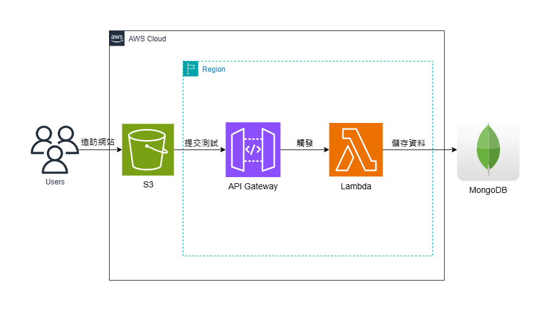

# AWS

運用AWS的S3服務，進行心理測驗網站託管，後端連接API和Lambda，將用戶測驗結果打入MongoDB雲端資料庫，進行儲存。

架構圖：<br>


## 程式碼

分為兩個檔案夾：**Website**、**Lamdba**。

### Website

放置**動態頁面 - 心理測驗網站**的程式碼。

Code：
```bash=
# 主要頁面
index.html

# 版面配置
styles.css

# 動態網頁驅動
psychTest.js
```

### Lambda

放置在AWS Lambda中的程式碼，用於接收資料，打入資料庫。

Code：
```bash=
# 後端程式碼
lambda.js

# 串接MongoDB的套件
layer.zip
```