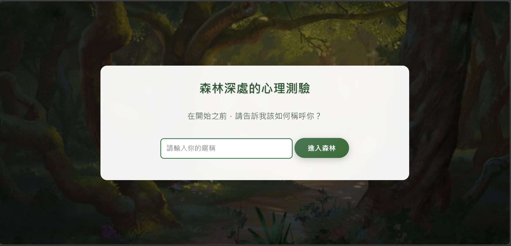
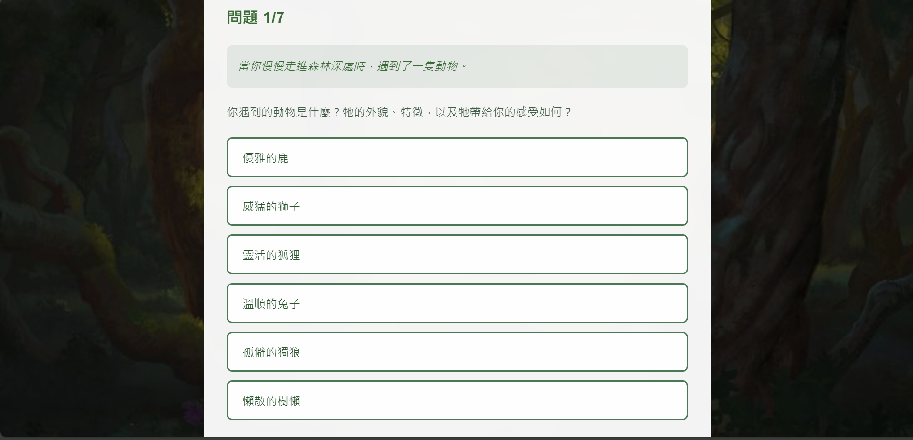

# AWS_S3_html

在伺服器上架設心理測驗網站，蒐集資料，藉由後端程式碼，打入資料庫中進行儲存。

分為兩種形式：
1. AWS：
運用AWS的**S3**服務，進行心理測驗網站託管，後端連接AWS的**API**和**Lambda**服務，將用戶測驗結果打入MongoDB雲端資料庫，進行儲存。

2. Linux：
在**Linux Ubuntu**伺服器上架設心理測驗網站，以**php**進行後端串接，傳輸資料到資料庫進行儲存。

## 成果展示：

初始畫面： 

畫面展示： 

傳輸資料： 

## 額外檔案
報告用ppt： 小乖.pdf
